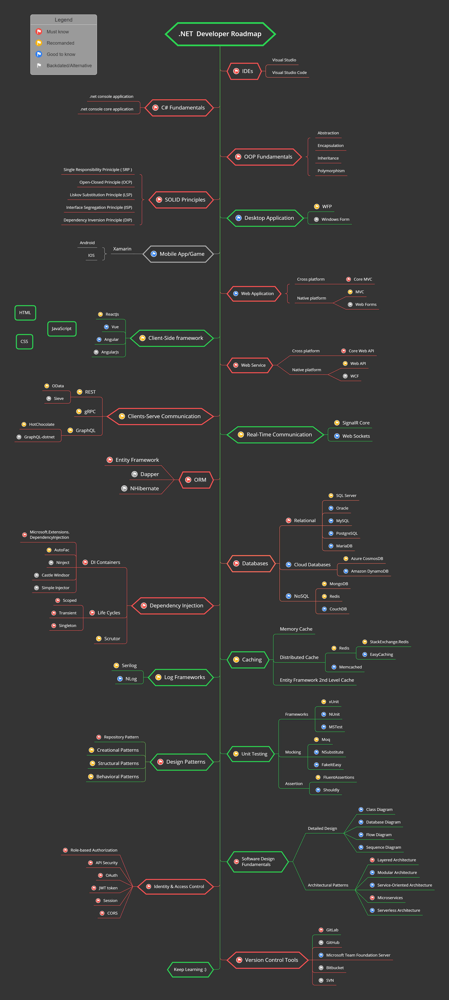

# .NET Developer Roadmap

> A practical, developer-focused **roadmap** to becoming a **Full stack .NET Developer** in 2026 — covering the essential tools, libraries, and concepts you need along the way.

Below you can find a chart demonstrating the paths that you can take and the libraries that you would want to learn to become a Full stack .NET developer. I made this chart as a tip for everyone who asks me, "What should I learn next as a .NET developer?"

> **Note:** The purpose of this roadmap is to give you an idea about the landscape. It will guide you if you are confused about what to learn next, rather than encouraging you to pick what is hip and trendy. Grow some understanding of why one tool would be better suited for some cases than another — hip and trendy does not always mean best suited for the job.

## Table of Contents

| No. | Topic                                                               |
| --- | ------------------------------------------------------------------- |
| 1   | [Roadmap](#1-roadmap)                                               |
| 2   | [IDEs](#2-ides)                                                     |
| 3   | [Prerequisites](#3-prerequisites)                                   |
| 4   | [OOP and SOLID Principles](#4-oop-and-solid-principles)             |
| 5   | [Desktop Application Frameworks](#5-desktop-application-frameworks) |
| 6   | [Mobile and Game Development](#6-mobile-and-game-development)       |
| 7   | [Web Application Frameworks](#7-web-application-frameworks)         |
| 8   | [Client-Side Frameworks](#8-client-side-frameworks)                 |
| 9   | [Web Services and APIs](#9-web-services-and-apis)                   |
| 10  | [Real-Time Communication](#10-real-time-communication)              |
| 11  | [ORM](#11-orm)                                                      |
| 12  | [Databases](#12-databases)                                          |
| 13  | [Dependency Injection](#13-dependency-injection)                    |
| 14  | [Caching](#14-caching)                                              |
| 15  | [Logging](#15-logging)                                              |
| 16  | [Testing](#16-testing)                                              |
| 17  | [Security](#17-security)                                            |
| 18  | [Design Patterns](#18-design-patterns)                              |

## 1. Roadmap

    

**[⬆ Back to Top](#table-of-contents)**

## 2. IDEs

| IDE                                                          | Short Description                              | Pricing      |
| ------------------------------------------------------------ | ---------------------------------------------- | ------------ |
| [Visual Studio](https://visualstudio.microsoft.com/)         | Full-featured IDE for .NET and C# development. | **Freemium** |
| [Visual Studio Code](https://code.visualstudio.com/Download) | Lightweight and highly extensible code editor. | **Free**     |
| [JetBrains Rider](https://www.jetbrains.com/rider/)          | Powerful cross-platform .NET IDE.              | **Freemium** |
| [Cursor](https://www.cursor.com/)                            | AI-powered code editor with smart assistance.  | **Freemium** |

**[⬆ Back to Top](#table-of-contents)**

## 3. Prerequisites

- [C#](https://learn.microsoft.com/en-us/dotnet/csharp/)
- [.NET](https://learn.microsoft.com/en-us/dotnet/)
- [ASP.NET Core](https://learn.microsoft.com/en-us/aspnet/core/)
- [SQL Fundamentals](https://www.w3schools.com/sql/)
- [HTML](https://www.w3schools.com/html/)
- [CSS](https://www.w3schools.com/css/)
- [JavaScript](https://www.w3schools.com/js/)

**[⬆ Back to Top](#table-of-contents)**

## 4. OOP and SOLID Principles

- [OOP C# Fundamentals](https://www.w3schools.com/cs/cs_oop.asp)
- [SOLID Design Principles in C#](https://dotnettutorials.net/course/solid-design-principles/)

**[⬆ Back to Top](#table-of-contents)**

## 5. Desktop Application Frameworks

- [WPF](https://learn.microsoft.com/en-us/dotnet/desktop/wpf/overview/) - Modern UI framework for building Windows desktop applications
- [Windows Forms](https://learn.microsoft.com/en-us/dotnet/desktop/winforms/) - Simple and fast way to build classic Windows desktop applications

**[⬆ Back to Top](#table-of-contents)**

## 6. Mobile and Game Development

- [.NET MAUI](https://learn.microsoft.com/en-us/dotnet/maui/what-is-maui) - Cross-platform framework for building native mobile and desktop apps
- [Cross-platform mobile development in Visual Studio](https://learn.microsoft.com/en-us/visualstudio/cross-platform/cross-platform-mobile-development-in-visual-studio?view=vs-2022)
- [Unity](https://unity.com/) - Leading platform for game development with C#

> Note: [Xamarin](https://learn.microsoft.com/en-us/xamarin/) reached end of support on May 1, 2024 — prefer [.NET MAUI](https://learn.microsoft.com/en-us/dotnet/maui/) for new cross-platform mobile apps.

**[⬆ Back to Top](#table-of-contents)**

## 7. Web Application Frameworks

- [ASP.NET Core MVC](https://learn.microsoft.com/en-us/aspnet/core/mvc/overview) - Pattern-based way to build dynamic websites with clean separation of concerns
- [Razor Pages](https://learn.microsoft.com/en-us/aspnet/core/razor-pages/) - Page-focused model for building web UI with less ceremony
- [Blazor](https://learn.microsoft.com/en-us/aspnet/core/blazor/) - Build interactive web UIs using C# instead of JavaScript
- [ASP.NET MVC](https://learn.microsoft.com/en-us/aspnet/mvc/) _(Legacy)_
- [ASP.NET Web Forms](https://learn.microsoft.com/en-us/aspnet/web-forms/) _(Legacy)_

**[⬆ Back to Top](#table-of-contents)**

## 8. Client-Side Frameworks

- [React Developer Roadmap](https://github.com/saifaustcse/react-developer-roadmap)
- [Vue Developer Roadmap](https://github.com/saifaustcse/vue-developer-roadmap)
- [Angular Developer Roadmap](https://github.com/saifaustcse/angular-developer-roadmap)

**[⬆ Back to Top](#table-of-contents)**

## 9. Web Services and APIs

- REST
  - [Web API with ASP.NET Core](https://learn.microsoft.com/en-us/aspnet/core/tutorials/first-web-api) - Build HTTP services with ASP.NET Core
  - [OData](https://devblogs.microsoft.com/odata/experimenting-with-odata-in-asp-net-core-3-1) - Open protocol for querying and updating data
  - [Sieve](https://github.com/Biarity/Sieve) - Simple sorter, filter, and paginator for .NET
  - [ASP.NET Web API](https://learn.microsoft.com/en-us/aspnet/web-api/) _(Legacy)_
- gRPC
  - [gRPC in ASP.NET Core](https://learn.microsoft.com/en-us/aspnet/core/grpc) - High-performance RPC framework
- GraphQL
  - [HotChocolate](https://github.com/ChilliCream/hotchocolate) - GraphQL server for .NET
  - [GraphQL-dotnet](https://github.com/graphql-dotnet/graphql-dotnet) - GraphQL implementation for .NET
- SOAP
  - [WCF](https://learn.microsoft.com/en-us/dotnet/framework/wcf/getting-started-tutorial) _(Legacy)_

**[⬆ Back to Top](#table-of-contents)**

## 10. Real-Time Communication

- [SignalR](https://learn.microsoft.com/en-us/aspnet/core/signalr) - Library for adding real-time web functionality to apps
- [WebSockets](https://learn.microsoft.com/en-us/aspnet/core/fundamentals/websockets) - Bidirectional, full-duplex communication over TCP

**[⬆ Back to Top](#table-of-contents)**

## 11. ORM

- [Entity Framework Core](https://learn.microsoft.com/en-us/ef/core/) - Modern object-database mapper for .NET
- [Entity Framework 6](https://learn.microsoft.com/en-us/ef/ef6/) - Tested object-relational mapper for .NET
- [Dapper](https://github.com/StackExchange/Dapper) - Simple object mapper with high performance
- [NHibernate](https://github.com/nhibernate/nhibernate-core) - Mature, feature-rich ORM ported from Java Hibernate

**[⬆ Back to Top](#table-of-contents)**

## 12. Databases

- Relational
  - [SQL Server](https://www.microsoft.com/sql-server/)
  - [Oracle](https://www.oracle.com/database/technologies/oracle-database-software-downloads.html)
  - [MySQL](https://www.mysql.com/)
  - [PostgreSQL](https://www.postgresql.org/)
  - [MariaDB](https://mariadb.org/)
- Cloud Databases
  - [CosmosDB](https://learn.microsoft.com/en-us/azure/cosmos-db/)
  - [DynamoDB](https://aws.amazon.com/dynamodb/)
- NoSQL
  - [Redis](https://redis.io/)
  - [MongoDB](https://learn.microsoft.com/en-us/aspnet/core/tutorials/first-mongo-app)
  - [Apache Cassandra](https://cassandra.apache.org/)
  - [LiteDB](https://github.com/mbdavid/LiteDB)
  - [RavenDB](https://github.com/ravendb/ravendb)
  - [CouchDB](https://couchdb.apache.org/)

**[⬆ Back to Top](#table-of-contents)**

## 13. Dependency Injection

- [Dependency Injection](https://dotnettutorials.net/lesson/dependency-injection-design-pattern-csharp/) - Design pattern implementing Inversion of Control
- DI Containers
  - [Microsoft.Extensions.DependencyInjection](https://learn.microsoft.com/en-us/aspnet/core/fundamentals/dependency-injection) - Built-in DI container
  - [AutoFac](https://autofac.readthedocs.io/en/latest/integration/aspnetcore.html)
  - [Ninject](https://github.com/ninject/ninject)
  - [Castle Windsor](https://github.com/castleproject/Windsor)
  - [Simple Injector](https://github.com/simpleinjector/SimpleInjector)
- [Service Lifetimes](https://learn.microsoft.com/en-us/aspnet/core/fundamentals/dependency-injection#service-lifetimes) - Transient, Scoped, and Singleton
- [Scrutor](https://github.com/khellang/Scrutor) - Conventional registration extensions

**[⬆ Back to Top](#table-of-contents)**

## 14. Caching

- [Memory Cache](https://learn.microsoft.com/en-us/aspnet/core/performance/caching/memory) - In-memory caching
- Distributed Cache
  - [Distributed Cache](https://learn.microsoft.com/en-us/aspnet/core/performance/caching/distributed)
  - [Redis](https://redis.io/)
    - [StackExchange.Redis](https://seredis.dev/)
    - [EasyCaching](https://github.com/dotnetcore/EasyCaching)
  - [Memcached](https://memcached.org/)
- Entity Framework 2nd Level Cache
  - [EFCoreSecondLevelCacheInterceptor](https://github.com/VahidN/EFCoreSecondLevelCacheInterceptor)
  - [EntityFrameworkCore.Cacheable](https://github.com/SteffenMangold/EntityFrameworkCore.Cacheable)

**[⬆ Back to Top](#table-of-contents)**

## 15. Logging

- Log Frameworks
  - [Serilog](https://github.com/serilog/serilog) - Structured logging with rich sinks
  - [NLog](https://github.com/NLog/NLog) - Flexible and free logging platform
- Log Management Systems
  - [Elastic Stack (ELK)](https://www.elastic.co/elastic-stack/)
  - [Sentry.io](https://sentry.io/)
  - [Loggly.com](https://loggly.com/)
  - [Elmah.io](https://elmah.io/)
  - [Datadog](https://www.datadoghq.com/)

**[⬆ Back to Top](#table-of-contents)**

## 16. Testing

- Unit Testing Frameworks
  - [xUnit](https://learn.microsoft.com/en-us/dotnet/core/testing/unit-testing-with-dotnet-test)
  - [NUnit](https://learn.microsoft.com/en-us/dotnet/core/testing/unit-testing-with-nunit)
  - [MSTest](https://learn.microsoft.com/en-us/dotnet/core/testing/unit-testing-with-mstest)
- Mocking
  - [Moq](https://github.com/moq/moq4)
  - [NSubstitute](https://github.com/nsubstitute/NSubstitute)
  - [FakeItEasy](https://github.com/FakeItEasy/FakeItEasy)
- Assertion
  - [FluentAssertions](https://github.com/fluentassertions/fluentassertions)
  - [Shouldly](https://github.com/shouldly/shouldly)

> Note: [FluentAssertions](https://github.com/fluentassertions/fluentassertions) moved to a paid license for commercial use starting with v8 — consider [Shouldly](https://github.com/shouldly/shouldly) or the free community fork [AwesomeAssertions](https://github.com/AwesomeAssertions/AwesomeAssertions).

**[⬆ Back to Top](#table-of-contents)**

## 17. Security

- [Application Settings & Configurations](https://learn.microsoft.com/en-us/aspnet/core/fundamentals/configuration/)
- [Authentication](https://learn.microsoft.com/en-us/aspnet/core/security/authentication/)
- [Authorization](https://learn.microsoft.com/en-us/aspnet/core/security/authorization/introduction)

**[⬆ Back to Top](#table-of-contents)**

## 18. Design Patterns

- [Design Patterns](https://dotnettutorials.net/course/dot-net-design-patterns/) - Gang of Four patterns implemented in C#
- [Refactoring.Guru](https://refactoring.guru/design-patterns/csharp) - Design patterns explained with examples in C#

**[⬆ Back to Top](#table-of-contents)**

## Author

**Md. Saiful Islam**
_Microsoft Certified Solutions Developer (MCSD) – Programming in C#_

**GitHub:** [@saifaustcse](https://github.com/saifaustcse)
**LinkedIn:** [Md. Saiful Islam](https://www.linkedin.com/in/saif-aust-cse/)

If you find this roadmap useful, please give :star:. Your support is appreciated!
